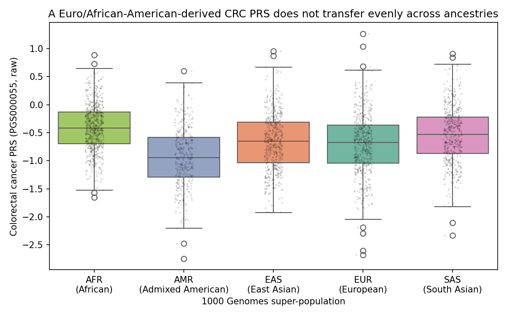
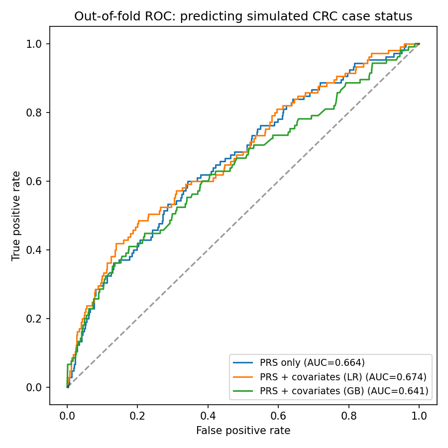
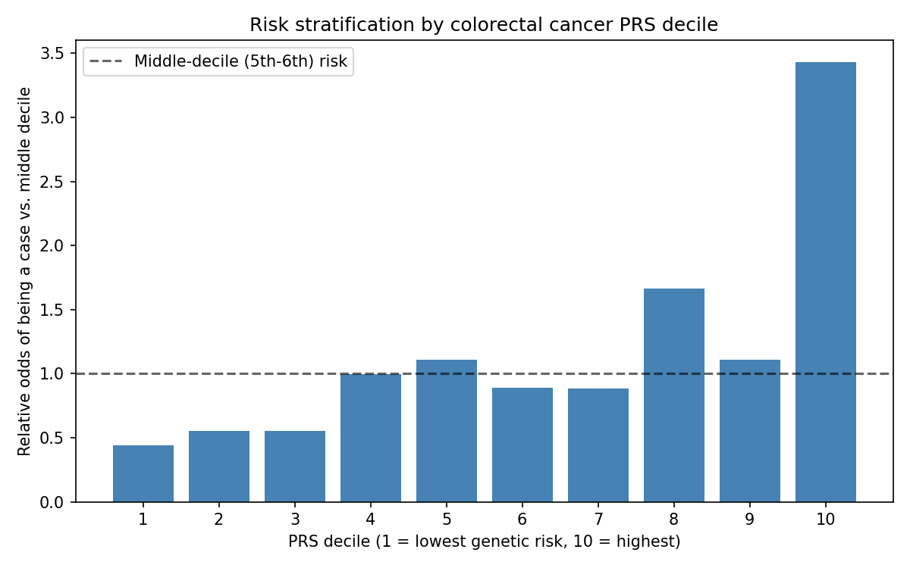
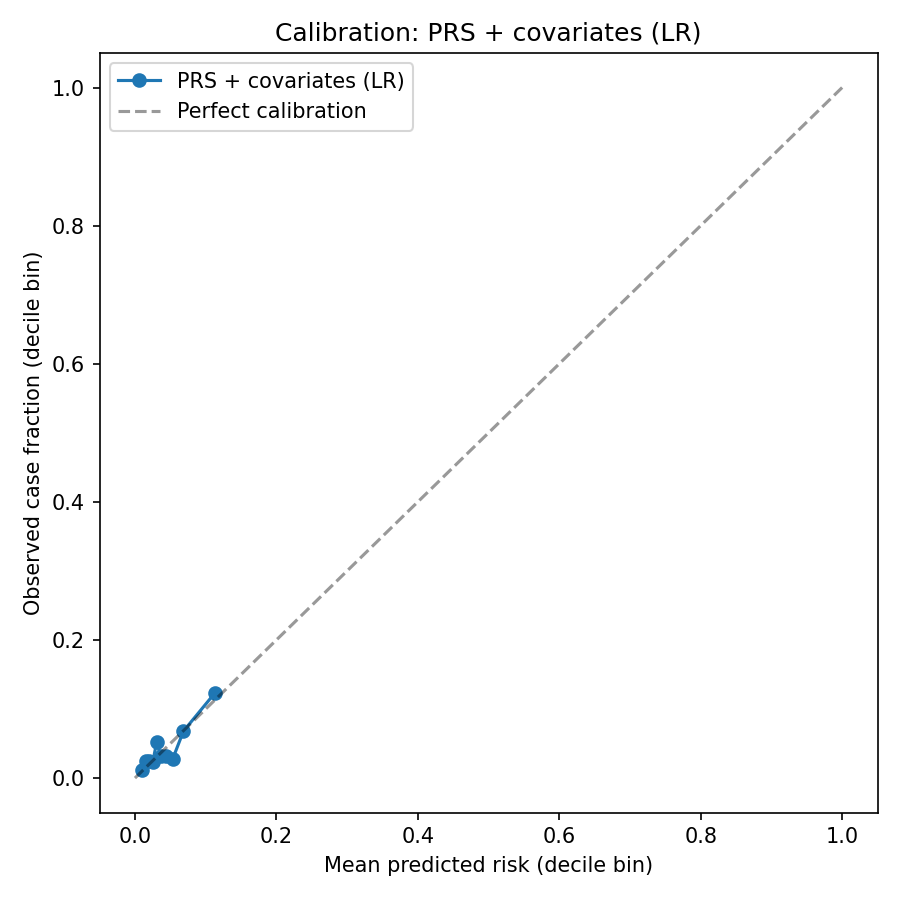

# Colorectal Cancer Polygenic Risk Score + ML

[](https://github.com/Zach-Girard/colorectal-cancer-prs-ml/actions/workflows/ci.yml)

This was my first project working with polygenic risk scores, so I built it
the way I'd want to actually learn the method: compute a real PRS from real
published GWAS weights and real genotypes rather than a toy example, check
whether it behaves the way the literature says it should, and only then
build a machine learning layer on top of it. Along the way that meant
learning why GWAS "effect alleles" aren't always the same as a VCF's ALT
allele, why polygenic scores don't transfer cleanly across ancestries, and
why a bigger/fancier model (gradient boosting) isn't automatically better
than logistic regression.

## What is a polygenic risk score?

A polygenic risk score is a single number meant to summarize someone's
inherited genetic risk for a condition, built from a genome-wide
association study (GWAS) that already identified which SNPs (single DNA
letter changes) are statistically associated with that condition, and by
how much. Each associated SNP gets an **effect weight** (roughly, the
log-odds increase in risk per copy of the risk-associated allele) from the
GWAS. To score a new person, you count how many copies of the risk allele
they carry at each SNP -- 0, 1, or 2, called the **dosage** -- and take a
weighted sum:

```
PRS = sum over all scored SNPs of (dosage x effect_weight)
```

That's it -- there's no hidden complexity, which is part of why PRS is
appealing clinically. The hard parts, which this project runs into
directly, are (1) making sure a SNP's "effect allele" in the weights file
is matched to the correct allele in your genotype data, since GWAS papers
don't all report alleles relative to the same reference strand or column
order, and (2) that the SNPs and their weights were estimated in a
specific ancestry group, so applying the score to someone from a different
ancestry can be misleading -- both are covered below with real data, not
just asserted.

## A note on the data, up front

This is the most important thing to understand about this repo, so it's
here before anything else:

**Individual-level genotype data linked to real cancer diagnoses is
controlled-access** (UK Biobank, dbGaP, TCGA germline calls, etc.) and
cannot legally or ethically be redistributed in a public GitHub repo. So
rather than pretend otherwise, this project is explicit about exactly
which parts of the data are real and which are simulated:

| Component | Real or simulated? | Source |
| --- | --- | --- |
| GWAS effect weights (76 SNPs) | **Real** | [PGS000055](https://www.pgscatalog.org/score/PGS000055/) (Schmit et al., *J Natl Cancer Inst* 2019), from the PGS Catalog |
| Genotypes (2,504 individuals) | **Real** | 1000 Genomes Project, Phase 3 |
| Ancestry / super-population labels | **Real** | 1000 Genomes sample panel |
| Sex | **Real** | 1000 Genomes sample panel |
| Polygenic risk score itself | **Real** (computed from the two real inputs above, standard weighted-sum formula) | — |
| Age | **Simulated** | Drawn independently, not linked to any real attribute |
| Family history of CRC | **Simulated** | Drawn independently |
| Colorectal cancer case/control label | **Simulated**, via a logistic risk model whose PRS coefficient is calibrated to reproduce the *actually published* AUROC for PGS000055 (0.65, 95% CI 0.62-0.69) | See `scripts/05_simulate_phenotype.py` docstring |

In other words: the genetics are 100% real, and only the disease outcome
needed to be simulated to demonstrate the ML workflow end to end. This is
the same strategy used in PRS methods papers to validate a new approach
before ever touching biobank data.

## Two things I wanted to actually demonstrate, not just assert

It would have been easy to write a paragraph in this README claiming "PRS
doesn't transfer across ancestries" and "simulations should be calibrated
to real effect sizes" without showing either one. Since both are things I
was learning for the first time, I wanted to see them happen on real data
before I'd trust myself to explain them to someone else:

1. **Real allele-frequency-driven population differences.** 1000 Genomes
   spans 5 real ancestry super-populations (AFR, AMR, EAS, EUR, SAS).
   Computing the real PRS for all of them shows a large, statistically
   significant difference in mean PRS across ancestries (one-way ANOVA --
   a standard test for whether the average of a numeric value, here PRS,
   differs across more than two groups -- gives F=74.4, p≈1×10⁻⁵⁹). That
   difference comes purely from allele frequencies differing between
   populations at the 76 scored SNPs, not from a real 74-sigma difference
   in colorectal cancer risk between these groups. This is the real-world
   "PRS portability problem": a score trained on African American and
   European ancestry GWAS (as PGS000055 was) systematically over- or
   under-estimates genetic risk when applied to a South Asian or East
   Asian genome, and clinical deployment of PRS without ancestry-aware
   recalibration is a genuinely unsolved, actively researched problem --
   not a hypothetical caveat I'm raising for effect.
2. **Calibrating the simulated outcome against a real reported effect
   size**, rather than picking a number that "seemed reasonable." Because
   of that, the PRS-only AUC produced by this pipeline (≈0.66) can be
   directly compared to the actual number Schmit et al. reported for this
   score in an independent validation cohort (0.65) -- see the Results
   section below for how close they land.

## Pipeline

| Step | Script | What happens |
| --- | --- | --- |
| 1 | `01_download_pgs_weights.sh` | Downloads PGS000055 (76 SNPs, hg19/GRCh37) from the PGS Catalog |
| 2 | `02_extract_1000genomes_genotypes.sh` | Uses `tabix` to query only those 76 exact genome positions directly from the remote, indexed 1000 Genomes VCFs, so it never has to download a whole ~1 GB-per-chromosome file just to read out a handful of SNPs |
| 3 | `03_compute_prs.py` | For each SNP, matches the GWAS "effect allele" to the VCF's REF/ALT (they're not always the same allele -- see below), reads each person's dosage (0/1/2 copies), and sums `dosage x weight` across all 76 SNPs per person -- the same calculation tools like PLINK `--score` or PRSice perform |
| 4 | `04_ancestry_transferability_analysis.py` | Real-data-only: compares the real PRS distribution across the 5 super-populations with an ANOVA test |
| 5 | `05_simulate_phenotype.py` | The one place simulated data enters the pipeline: assigns each person a case/control label via a logistic risk model calibrated to a real published effect size (see the data table above) |
| 6 | `06_train_evaluate_models.py` | Trains logistic regression (PRS-only and PRS+covariates) and gradient boosting classifiers with 5-fold cross-validation, then produces the ROC, calibration, and risk-decile figures used to judge how good (and how well-calibrated) each model actually is |

## Quickstart

```bash
conda env create -f environment.yml
conda activate prs-cancer-ml
bash scripts/run_all.sh
```

Figures land in `figures/`, tables in `results/`. Runs in a couple of
minutes — the "big" 1000 Genomes VCFs are queried remotely for 76 positions
each, never downloaded in full.

## Results

### 1. A Euro/African-American-derived score doesn't transfer evenly across ancestries (100% real data)



Mean PRS differs significantly across all 5 super-populations (one-way
ANOVA F=74.45, p=1.08×10⁻⁵⁹; full table in
[`docs/example_output/prs_by_superpopulation.csv`](docs/example_output/prs_by_superpopulation.csv),
full write-up in
[`docs/example_output/ancestry_anova.txt`](docs/example_output/ancestry_anova.txt)).
Concretely: if you didn't know any better, you might read "AMR individuals
have a lower average PRS than AFR individuals" as "AMR individuals are at
lower genetic risk of colorectal cancer." What it actually reflects is that
PGS000055's 76 SNPs have different allele frequencies across these
populations, which is exactly why applying a PRS across ancestries without
recalibration is misleading rather than just imprecise.

### 2. ML classifiers on the simulated cohort

To judge how good each model is at telling future cases apart from
controls, I used **AUC** (area under the ROC curve): a score of 0.5 means
the model is no better than a coin flip, and 1.0 means perfect separation.
Because there are only ~105 simulated cases among 2,504 people, I used
5-fold cross-validation (fitting on 4/5 of the data and testing on the
held-out 1/5, five times, so every person is tested on exactly once) rather
than a single train/test split, which would have given a much noisier,
one-shot estimate.

| Model | 5-fold CV AUC |
| --- | --- |
| Logistic regression, PRS only | 0.664 ± 0.041 |
| Logistic regression, PRS + age + family history + sex | 0.674 ± 0.050 |
| Gradient boosting, PRS + covariates | 0.641 ± 0.061 |

The PRS-only AUC (0.664) lands right on top of the actually published
AUROC for PGS000055 (0.65) — which is exactly what the simulation was
calibrated to reproduce, so this is a sanity check that the calibration
worked rather than an independent finding. What I didn't expect going in,
but makes sense in hindsight, is that gradient boosting doesn't beat plain
logistic regression here. Gradient boosting's advantage is capturing
nonlinear effects and interactions, but the risk model I simulated is
purely linear (a weighted sum of PRS, age, and family history) with very
few positive cases to learn from -- so the extra flexibility has nothing
real to fit and mostly picks up noise instead. It's a useful reminder that
a fancier model isn't automatically a better one; it has to match how much
signal and data you actually have.



Two more ways of expressing the same PRS effect, both standard in the PRS
literature: the **odds ratio per 1-SD increase in PRS** answers "how much
do your odds of being a case go up for each standard deviation increase in
genetic risk score?" (here: **1.86×**, i.e. odds nearly double). The
**risk-decile plot** below splits everyone into 10 equal-sized groups by
PRS and shows each group's odds of being a case relative to the
middle-decile group -- here, people in the top 10% of genetic risk have
**3.43×** the odds of the average-risk group. Both numbers are very much
in line with what's typically reported for cancer PRS scores in the
literature, which was reassuring to see given they emerged from the
calibration rather than being targeted directly.



A model can separate cases from controls well (high AUC) while still being
badly *miscalibrated* -- e.g. consistently telling people their risk is
10% when it's actually 20%. The calibration curve below checks this
directly by grouping people into deciles of predicted risk and plotting
each group's predicted risk against how often they were actually a case;
points sitting on the diagonal mean the model's predicted probabilities
can be taken at face value, not just used for ranking:



Full metrics: [`docs/example_output/model_performance.csv`](docs/example_output/model_performance.csv),
[`docs/example_output/prs_decile_odds_ratios.csv`](docs/example_output/prs_decile_odds_ratios.csv).

## Repository structure

```text
.
├── environment.yml
├── scripts/
│   ├── 01_download_pgs_weights.sh
│   ├── 02_extract_1000genomes_genotypes.sh
│   ├── 03_compute_prs.py
│   ├── 04_ancestry_transferability_analysis.py
│   ├── 05_simulate_phenotype.py
│   ├── 06_train_evaluate_models.py
│   └── run_all.sh
├── docs/example_output/          # curated figures/tables shown above
├── .github/workflows/ci.yml      # runs the full pipeline on every push
├── data/, figures/, results/     # created locally at run time (gitignored)
└── LICENSE
```

## Limitations

Being upfront about what this project doesn't solve, in the same spirit as
the data table above:

- **The disease label is simulated.** This is the whole point of the data
  table above, but it's worth repeating: no conclusions about real-world
  colorectal cancer risk should be drawn from the ML section — only the
  *methodology* is meant to generalize.
- **PRS was standardized on the full multi-ancestry cohort**, not within
  each population separately. This mirrors a common (and, per the
  transferability analysis above, clearly imperfect) real-world practice;
  a more rigorous approach would standardize within ancestry or use an
  ancestry-calibrated score.
- **Small case count (~105 of 2,504).** AUC confidence intervals from
  cross-validation are correspondingly wide; a real clinical validation
  would need a much larger, prospectively phenotyped cohort — which is
  exactly why resources like UK Biobank exist and require controlled
  access.
- **Only 76 SNPs.** PGS000055 predates genome-wide PRS methods like
  LDpred/PRS-CS that use millions of variants and generally achieve higher
  AUC; it was chosen here specifically because its small, curated variant
  list keeps genotype extraction fast and auditable for a demo pipeline.

## Skills demonstrated

Polygenic risk score methodology (real GWAS Catalog/PGS Catalog effect
weights, correct effect/other allele matching against VCF REF/ALT,
multi-allelic site handling), large remote-file querying (`tabix` range
queries against multi-gigabyte indexed VCFs without full downloads),
population genetics (1000 Genomes super-populations, PRS ancestry
transferability), simulation methodology calibrated against real published
effect sizes, and applied ML (scikit-learn: logistic regression, gradient
boosting, stratified cross-validation, ROC/AUC, calibration curves, risk
stratification) — plus the judgment to be explicit about what's real data
and what isn't, which matters as much as the code in a domain like this.
